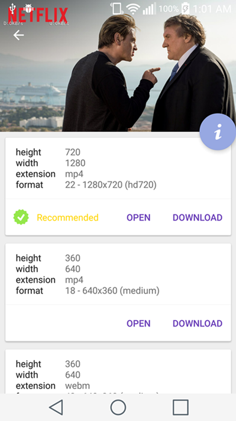
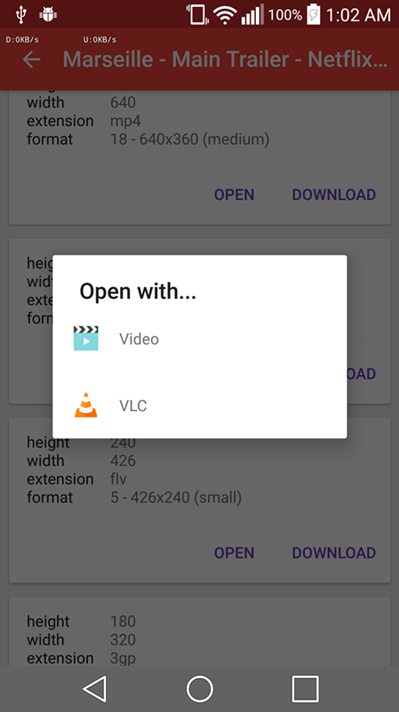
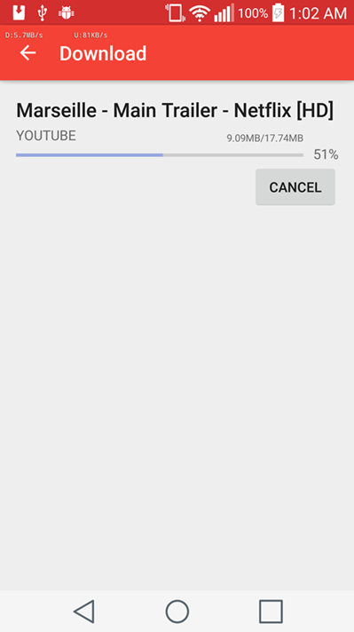

Gimme The File
===
Share any link with this app and download video or music of various formats and sizes.

Basically, an Android client with a [youtube-dl](http://rg3.github.io/youtube-dl/) backend.

Images
---
  

Building
---
Create an 'app.properties' file with a 'BASE_URL' field pointing to the base url of where your youtube-dl client is hosted.
Please see more [here](server/README.md).